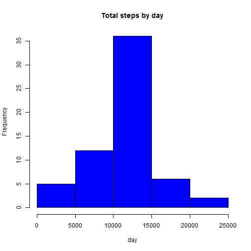

##Introduction
It is now possible to collect a large amount of data about personal movement using activity monitoring devices such as a Fitbit, Nike Fuelband, or Jawbone Up. These type of devices are part of the "quantified self" movement - a group of enthusiasts who take measurements about themselves regularly to improve their health, to find patterns in their behavior, or because they are tech geeks. But these data remain under-utilized both because the raw data are hard to obtain and there is a lack of statistical methods and software for processing and interpreting the data.

This assignment makes use of data from a personal activity monitoring device. This device collects data at 5 minute intervals through out the day. The data consists of two months of data from an anonymous individual collected during the months of October and November, 2012 and include the number of steps taken in 5 minute intervals each day.

##Loading and preprocessing the data
The data is downloaded and kept in the local directory.

```r
#load the data
data <- read.csv(unz("repdata-data-activity.zip", "activity.csv"), header = T)

# convert date to date data type
data$date <- as.Date(data$date)
```

##What is mean total number of steps taken per day?
Here missing values are ignored. Histogram of total number of steps taken per day is plotted and mean & medain of steps per day is being reported.


```r
data_clean <- na.omit(data)

# sum steps by date
daily_steps <- rowsum(data_clean$steps, format(data_clean$date, '%Y-%m-%d'))

daily_steps <- data.frame(daily_steps)

names(daily_steps) <- ("steps") 
```

Plot histogram of the total number of steps taken each day:


```r
hist(daily_steps$steps, main=" ", breaks=10, xlab="Total Number of Steps Taken Daily")
```

 

Report mean and median of steps:


```r
mean(daily_steps$steps)
```

```
## [1] 10766.19
```

```r
median(daily_steps$steps)
```

```
## [1] 10765
```

##What is the average daily activity pattern?

* A time series plot (i.e. type = "l") of the 5-minute interval (x-axis) and the average number of steps taken, averaged across all days (y-axis) is plotted. 
* Which 5-minute interval, on average across all the days in the dataset, contains the maximum number of steps is being analysed.


```r
library(plyr)
```

```
## Warning: package 'plyr' was built under R version 3.1.3
```

```r
# Calculate average steps for each of 5-minute interval during a 24-hour period
interval_meansteps <- ddply(data_clean, ~interval, summarise, mean=mean(steps))

library(ggplot2)
```

```
## Warning: package 'ggplot2' was built under R version 3.1.3
```

```r
qplot(x=interval, y=mean, data = interval_meansteps,  geom = "line",
      xlab="5-Minute Interval",
      ylab="Number of Step Count",
      main="Average Number of Steps Taken Averaged Across All Days"
      )
```

 

Report the 5-min interval, on average across all the days in the dataset, contains the maximum number of steps:


```r
interval_meansteps[which.max(interval_meansteps$mean), ]
```

```
##     interval     mean
## 104      835 206.1698
```

Based on steps taken pattern, the person's daily activity peaks around 8:35am.

##Imputing missing values

Here total number of missing values in the dataset (i.e. the total number of rows with NAs) are calculated & reported.


```r
missing_vals <- sum(is.na(data$steps))

missing_vals
```

```
## [1] 2304
```

Devise a strategy for filling in all of the missing values in the dataset. The strategy does not need to be sophisticated. For example, you could use the mean/median for that day, or the mean for that 5-minute interval,etc

Fist Na replaced by mean in 5 min interval


```r
StepsAverage <- aggregate(steps ~ interval, data, mean)
fillNA <- numeric()
for (i in 1:nrow(data)) {
    obs <- data[i, ]
    if (is.na(obs$steps)) {
        steps <- subset(StepsAverage, interval == obs$interval)$steps
    } else {
        steps <- obs$steps
    }
    fillNA <- c(fillNA, steps)
}
```

Create a new dataset that is equal to the original dataset but with the missing data filled in.


```r
new_activity <- data
new_activity$steps <- fillNA
```

Make a histogram of the total number of steps taken each day and Calculate and report the mean and median total number of steps taken per day. Do these values differ from the estimates from the first part of the assignment? What is the impact of imputing missing data on the estimates of the total daily number of steps?


```r
Stepstotal <- aggregate(steps ~ date, data = new_activity, sum, na.rm = TRUE)

hist(Stepstotal$steps, main = "Total steps by day", xlab = "day", col = "blue")
```

 

The mean and median are:


```r
mean(Stepstotal$steps)
```

```
## [1] 10766.19
```

```r
median(Stepstotal$steps)
```

```
## [1] 10766.19
```

After replacing the mean is the same but the median is a little bit different

##Are there differences in activity patterns between weekdays and weekends?

For this part the weekdays() function may be of some help here. Use the dataset with the filled-in missing values for this part.

Create a new factor variable in the dataset with two levels – “weekday” and “weekend” indicating whether a given date is a weekday or weekend day.


```r
day <- weekdays(data$date)
daylevel <- vector()
for (i in 1:nrow(data)) {
    if (day[i] == "Saturday") {
        daylevel[i] <- "Weekend"
    } else if (day[i] == "Sunday") {
        daylevel[i] <- "Weekend"
    } else {
        daylevel[i] <- "Weekday"
    }
}
data$daylevel <- daylevel
data$daylevel <- factor(data$daylevel)

stepsByDay <- aggregate(steps ~ interval + daylevel, data, mean)
names(stepsByDay) <- c("interval", "daylevel", "steps")
```

Make a panel plot containing a time series plot (i.e. type = "l") of the 5-minute interval (x-axis) and the average number of steps taken, averaged across all weekday days or weekend days (y-axis). The plot should look something like the following, which was creating using simulated data:


```r
library(lattice)
xyplot(steps ~ interval | daylevel, stepsByDay, type = "l", layout = c(1, 2), 
    xlab = "Interval", ylab = "Number of steps")
```

 

The plot indicates that the person moves around more (or more active) during the weekend days.


